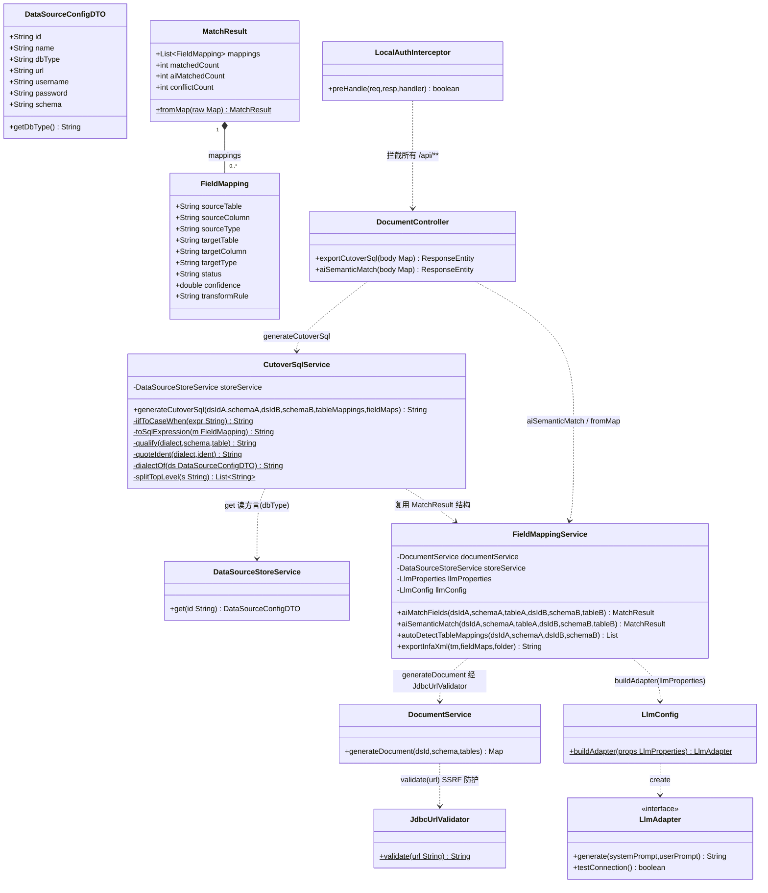
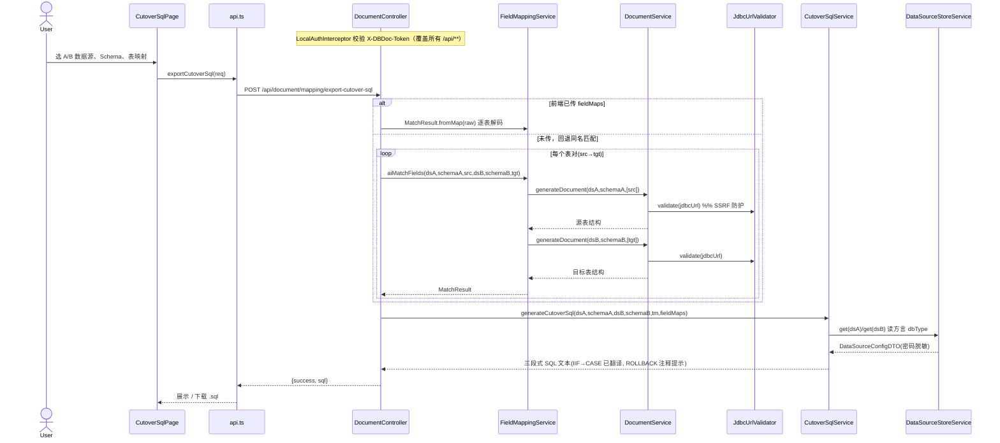
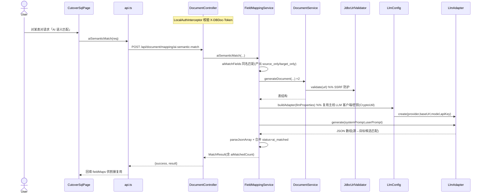
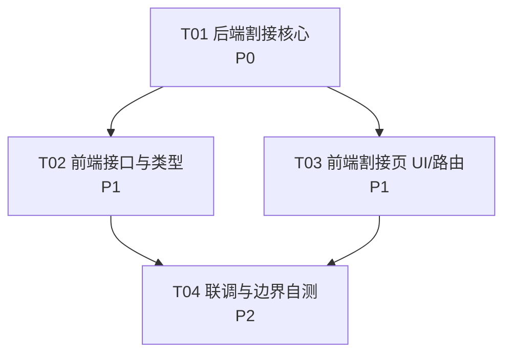

# dbdoc-ai：桌面副本独有功能合并至工作空间主线 —— 增量架构设计 + 任务分解

> 范围：合并 ① `CutoverSqlService.generateCutoverSql` 双库割接 SQL 生成；② 端点 `POST /mapping/export-cutover-sql`；③ 端点 `POST /mapping/ai-semantic-match`（AI 字段语义匹配）；④ 前端「割接 SQL 导出」UI 入口。
> 非目标：不合并 `PgTest.java`（硬编码凭据红线）；不引入已重构移除的早期冗余代码；不改工作空间已有的安全审计闭环（本地鉴权 + JDBC SSRF 防护）。

---

## Part A：系统设计

### 1. 实现方案与框架选型

沿用工作空间主线技术栈，**不引入新技术栈**：

- 后端：Spring Boot + Java（与主线一致）
- 前端：React 18 + TypeScript + 纯 CSS（主线实际为 `index.css` 全局类 + 内联样式，**未使用 MUI/Tailwind/组件库**，遵循现状）
- 数据库访问/鉴权：主线既有 `DataSourceStoreService`、`JdbcUrlValidator`、`LocalAuthInterceptor`、`CryptoUtil`、`LlmConfig`
- LLM：`LlmConfig.buildAdapter(llmProperties)` 复用主线客户端与配置（密钥经 `CryptoUtil` 加解密，超时见 `LlmRestTemplateConfig`）

**关键技术决策（对照主理人决策）：**

| 主理人决策 | 落地结论（基于代码核实） |
|---|---|
| R1 目标库方言 | 桌面 `CutoverSqlService` 已支持 mysql/postgresql/oracle/dm/sqlite 多方言（按 `dbType` 小写分支，mysql 用反引号，其余双引号；B 库 mysql 用 `START TRANSACTION` 其余 `BEGIN/COMMIT`）。**原样保留**该多方言逻辑，本次不扩展新方言（R7 列后续）。 |
| R2 ai-semantic-match 的 LLM 依赖 | 复用主线 `LlmConfig.buildAdapter(llmProperties)`（与 `LlmController`/`DocumentService` 同源）。为让运行时改配置生效，在 `aiSemanticMatch` 内**每次调用重建 adapter**（而非注入单例 bean），密钥经 `CryptoUtil` 加解密。 |
| R3 映射数据来源 | 主线 `FieldMappingService` **无持久化映射存储**，字段映射为按需计算。割接所需 `fieldMaps` 取值策略：**前端可预传 prebuilt（经 `MatchResult.fromMap` 解码）**，否则服务端回退到 `aiMatchFields`（同名匹配）—— 复用主线 `DocumentService.generateDocument` 通道读取双库结构。 |
| R4 ROLLBACK 形态 | 仅在割接 SQL 文档第③段输出 `-- ROLLBACK;` 提示性注释，**不包裹可执行事务**（降风险），不真正执行。 |
| R5 安全闭环 | 两个新端点位于 `/api/**`，由 `LocalAuthInterceptor` 统一拦截校验 `X-DBDoc-Token`；构建 `fieldMaps` 时的双库读取走 `DocumentService.generateDocument` → `JdbcUrlValidator.validate(url)`（SSRF 防护）。`CutoverSqlService` 本身**不新建 JDBC 连接**（仅读 ds 方言元数据），无新增攻击面。 |
| R6 大表策略(R10) | 本次 P2，不实现分批/限流；仅生成文本。 |

**难点：**
- 割接 SQL 生成是纯文本拼装，难点在 IIF→CASE 翻译与方言转义（`quoteIdent`）。直接移植桌面实现即可。
- ai-semantic-match 难点在 LLM JSON 解析鲁棒性（模型可能返回 ```json 围栏、前后多余文本），沿用桌面 `parseJsonArray` 容错。
- 主线 `FieldMappingService` 是重构精简版（缺少 `aiSemanticMatch` 与 `MatchResult.fromMap`），需补齐这两个能力以对齐桌面。

---

### 2. 文件列表（相对路径）

**后端**（基准：`backend/src/main/java/com/dbdocai/`）

| 文件 | 状态 | 说明 |
|---|---|---|
| `service/CutoverSqlService.java` | 【新增】 | 双库割接 SQL 生成器（移植桌面，多方言逻辑原样保留） |
| `service/FieldMappingService.java` | 【修改】 | 新增 `aiSemanticMatch(...)`、`MatchResult.fromMap(...)`、`parseJsonArray(...)`，注入 `LlmProperties`/`LlmConfig` |
| `controller/DocumentController.java` | 【修改】 | 注入 `CutoverSqlService`；新增 `export-cutover-sql`、`ai-semantic-match` 两个端点 |

**前端**（基准：`frontend/src/`）

| 文件 | 状态 | 说明 |
|---|---|---|
| `services/api.ts` | 【修改】 | 新增 `exportCutoverSql(...)`、`aiSemanticMatch(...)` |
| `types/api.ts` | 【修改】 | 新增 `CutoverSqlRequest`/`CutoverSqlResponse` 类型（复用既有 `MatchResult`/`FieldMapping`） |
| `pages/CutoverSqlPage.tsx` | 【新增】 | 割接 SQL 导出向导页（选 A/B 双库 → 自动检测表映射 → AI 匹配 → 生成 SQL → 预览/下载） |
| `App.tsx` | 【修改】 | 注册路由 `/mapping` → `CutoverSqlPage` |
| `pages/DataSourcePage.tsx` | 【修改】 | 头部新增「割接 SQL」入口链接（复用既有 `.btn-settings` 样式模式） |
| `index.css` | 【修改-可选】 | 仅补充割接页少量布局类（可复用既有 `.btn`/`.modal`/`.ds-item`），非必须 |

> 注：前端无既有 mapping UI 页面（仅有 `api.ts` 中的 `autoDetectTableMappings`/`aiMatchFields`/`exportInfaXml` 方法但无页面消费），故「割接 SQL 导出」为全新页面，复用既有 CSS 类与 `Toast`/`LoadingSkeleton`/`ErrorState`/`EmptyState` 组件。

---

### 3. 数据结构与接口

#### 3.1 映射数据结构（与 `FieldMappingService` 对齐）



#### 3.2 `CutoverSqlService.generateCutoverSql` 签名（移植桌面，保持入参/出参）

```java
/**
 * 生成三段式割接 SQL 文本（不执行、不建连接，仅拼装）。
 * @param dsIdA        源库数据源 id（经 DataSourceStoreService.get 读方言）
 * @param schemaA      源库 schema
 * @param dsIdB        目标库数据源 id
 * @param schemaB      目标库 schema
 * @param tableMappings 表映射列表，元素含 sourceTable/targetTable
 * @param fieldMaps    键为 "srcTable→tgtTable"，值为该表对的字段映射结果
 * @return 完整割接 SQL 文档（含头注释、①INSERT…SELECT、②行数校验、③ROLLBACK 提示）
 */
public String generateCutoverSql(String dsIdA, String schemaA,
                                 String dsIdB, String schemaB,
                                 List<Map<String, String>> tableMappings,
                                 Map<String, FieldMappingService.MatchResult> fieldMaps)
```

关键私有工具方法（须一并移植）：
- `String iifToCaseWhen(String expr)`：`IIF(cond,a,b)` → `CASE WHEN cond THEN a ELSE b END`（仅处理单层，顶层逗号按括号深度切分 `splitTopLevel`）。
- `String toSqlExpression(FieldMapping m)`：无 rule → 源列；`EXPR:...` → `iifToCaseWhen`；`CAST:...` → 原样保留（CAST 交给 infa/目标库）。
- `String qualify(dialect,schema,table)` / `String quoteIdent(dialect,ident)`：方言相关标识符引用（mysql 反引号，其余双引号）。

#### 3.3 端点 Request / Response

> 路径说明：PRD 写作 `/mapping/...`，但主线 `/api/document` 已是 `DocumentController` 前缀，**实际完整路径为 `/api/document/mapping/...`**，与既有 `auto-detect-tables`/`ai-match`/`export-infa-xml` 保持一致。

**① POST `/api/document/mapping/export-cutover-sql`**

Request body（`application/json`）：
```jsonc
{
  "dataSourceIdA": "字符串, 源库dsId",
  "schemaA":       "字符串, 源库schema(可空)",
  "dataSourceIdB": "字符串, 目标库dsId",
  "schemaB":       "字符串, 目标库schema(可空)",
  "tableMappings": [
    { "sourceTable": "SRC_T", "targetTable": "TGT_T" }
  ],
  "fieldMaps": {                // 可选；缺省时服务端回退 aiMatchFields 同名匹配
    "SRC_T→TGT_T": { "mappings": [ /* FieldMapping 数组 */ ], "matchedCount": 0, ... }
  }
}
```

Response：
```jsonc
{ "success": true, "sql": "-- 三段式割接 SQL 文本..." }
// 失败：{ "success": false, "error": "..." }   (errorResp: 非法参数 400 / 其他 500)
```

**② POST `/api/document/mapping/ai-semantic-match`**

Request body：
```jsonc
{
  "dataSourceIdA": "源库dsId", "schemaA": "源schema", "tableA": "源表",
  "dataSourceIdB": "目标库dsId", "schemaB": "目标schema", "tableB": "目标表"
}
```

Response：
```jsonc
{ "success": true, "result": { /* MatchResult: mappings[], matchedCount, aiMatchedCount, conflictCount */ } }
// LLM 调用失败或无可匹配项时，降级返回同名匹配 base（success 仍为 true）
```

#### 3.4 前端类型（`types/api.ts` 新增）

```ts
export interface CutoverSqlRequest {
  dataSourceIdA: string; schemaA?: string;
  dataSourceIdB: string; schemaB?: string;
  tableMappings: { sourceTable: string; targetTable: string }[];
  fieldMaps?: Record<string, MatchResult>; // 键 "src→tgt"
}
export interface CutoverSqlResponse {
  success: boolean; sql?: string; error?: string;
}
```

---

### 4. 程序调用流程（时序图）

#### 4.1 割接 SQL 导出（前端 → controller → service → 双库读取 → 生成）



#### 4.2 AI 字段语义匹配（复用主线 LLM 客户端）



---

### 5. 有序任务列表（详见 Part B 第 7 节）

---

## Part B：任务分解

### 6. 依赖包列表

- **后端**：无新增依赖。`com.fasterxml.jackson.databind.ObjectMapper`（Jackson）主线已随 LLM 适配器引入，`FieldMappingService.parseJsonArray` 直接复用。
- **前端**：无新增依赖。沿用 `react@^18`、`react-dom@^18`、`react-router-dom@^6`（已依赖）；UI 用主线既有纯 CSS（`index.css` + 内联样式），**不引入 MUI/Tailwind/组件库**。
- 若后续 `export-infa-xml` 也补齐 fieldMaps（不在本次范围），同样无需新依赖。

### 7. 任务列表（按依赖顺序，文件级）

> 规则约束：任务数 ≤ 5，单任务 ≥ 3 个相关文件，尽量仅依赖 T01。

#### T01【后端割接核心】P0 — 依赖：无
新建割接服务、补齐映射服务的语义匹配与解码能力、注册两个端点。
- 源文件：
  - `backend/.../service/CutoverSqlService.java`【新增】
  - `backend/.../service/FieldMappingService.java`【修改】（+`aiSemanticMatch` +`MatchResult.fromMap` +`parseJsonArray` + 注入 `LlmProperties`/`LlmConfig`）
  - `backend/.../controller/DocumentController.java`【修改】（注入 `CutoverSqlService`；新增 `export-cutover-sql`、`ai-semantic-match`；复用既有 `errorResp`）

#### T02【前端接口与类型层】P1 — 依赖：T01
补齐前端 API 方法与类型，供页面调用。
- 源文件：
  - `frontend/src/services/api.ts`【修改】（+`exportCutoverSql` +`aiSemanticMatch`）
  - `frontend/src/types/api.ts`【修改】（+`CutoverSqlRequest`/`CutoverSqlResponse`）
  - `frontend/src/services/api.test.ts`【修改】（为两个新 API 增加请求构造/契约测试）

#### T03【前端割接页 UI 与路由/导航】P1 — 依赖：T01
新建割接向导页，并接入路由与入口。
- 源文件：
  - `frontend/src/pages/CutoverSqlPage.tsx`【新增】
  - `frontend/src/App.tsx`【修改】（+`<Route path="/mapping" element={<CutoverSqlPage/>} />`）
  - `frontend/src/pages/DataSourcePage.tsx`【修改】（头部新增「割接 SQL」入口链接，复用 `.btn-settings` 样式模式）

#### T04【联调与边界自测】P2 — 依赖：T02、T03
覆盖边界（空表映射、LLM 失败降级、方言转义）与回归。
- 源文件：
  - `frontend/src/services/api.test.ts`【修改】（补充两个新 API 的 happy-path/失败路径用例）
  - `frontend/src/pages/CutoverSqlPage.tsx`【修改】（空映射、LLM 失败 Toast、SQL 复制/下载边界处理）
  - `docs/割接SQL_冒烟清单.md`【新增】（手动冒烟核对清单：双库连通、SSRF 拦截、鉴权 401、IIF→CASE 输出样例）

### 8. 共享知识（跨文件约定）

- **IIF→CASE 翻译规则**：仅处理单层 `IIF(cond,a,b)` → `CASE WHEN cond THEN a ELSE b END`；`CAST:...` 原样保留（交给目标库/infa）；遍历顶层逗号用括号深度切分。
- **字段映射结构字段名**（前后端一致）：`sourceTable/sourceColumn/sourceType`、`targetTable/targetColumn/targetType`、`status`（matched/ai_matched/conflict/source_only/target_only）、`confidence`(double)、`transformRule`。
- **表对 key**：统一为 `"sourceTable→targetTable"`（中文箭头），`fieldMaps` Map 的 key 与此一致。
- **SQL 方言约定**：`dbType` 取 `DataSourceConfigDTO.getDbType().toLowerCase()`；mysql 标识符用反引号，其余双引号；B 库为 mysql 用 `START TRANSACTION/COMMIT`，其余 `BEGIN/COMMIT`。
- **ROLLBACK 形态**：仅第③段输出 `-- ROLLBACK;` 注释提示，绝不包裹可执行事务。
- **安全闭环（强制）**：所有 `/api/**` 经 `LocalAuthInterceptor` 校验 `X-DBDoc-Token`；双库读取一律走 `DocumentService.generateDocument` → `JdbcUrlValidator.validate(url)`，不得在 `CutoverSqlService` 内另建 JDBC 连接绕过。
- **映射数据通道**：主线无持久化映射存储；`fieldMaps` 由前端预传或后端 `aiMatchFields` 复用主线生成文档通道计算，不新增存储。
- **LLM 复用**：`aiSemanticMatch` 内 `LlmConfig.buildAdapter(llmProperties)` 每次重建 adapter 以应用运行时配置；密钥经 `CryptoUtil` 加解密。

### 9. 待明确事项（代码层面的歧义 + 建议）

1. **端点路径前缀**：PRD 写 `/mapping/...`，主线实际为 `/api/document/mapping/...`。**建议**：保持 `/api/document/mapping/...` 与既有 mapping 端点一致（已在设计中采用）。若主理人坚持 PRD 字面路径，需把端点从 `DocumentController` 移至新的 `MappingController` 或在 `DocumentController` 上追加 `@RequestMapping` 别名——但会偏离现状，不推荐。
2. **`export-infa-xml` 现状为精简桩**：主线 `export-infa-xml` 当前忽略 `fieldMaps`（`Collections.emptyMap()`）。本次**不在范围**，但本次新增的 `MatchResult.fromMap` 已为其后续补齐（复用 prebuilt/aiMatchFields）铺路。建议：infa-xml 增强作为独立后续任务，不在本次合并。
3. **映射持久化**：主线 `FieldMappingService` 无 SQLite 映射存储（与 P2-1 设计文档中 `/api/mapping/save|load` 设想不同，已被重构移除）。因此割接/语义匹配均"即时计算 + 前端回传"。如需持久化，应单独立项，不混入本次。
4. **语义匹配 LLM 失败行为**：桌面实现在 LLM 异常时降级返回同名匹配 `base`（success=true）。**建议**：保持此安全降级，前端对 `aiMatchedCount=0` 给出提示即可。
5. **方言 R7 / 大表 R10**：按主理人决策本次不扩展方言、不实现分批限流，桌面多方言逻辑原样保留。后续若需 Oracle/达梦专属函数翻译，单列 R7 任务。
6. **`CutoverSqlService` 读取数据源元数据**：调用 `DataSourceStoreService.get(id)` 返回**脱敏** DTO（密码为 `***`），仅需 `dbType` 决定方言，不触碰凭据，符合安全约定；若未来需要真正执行 COUNT 校验，必须在该路径同样先过 `JdbcUrlValidator` 且复用 `getWithSecret`（绝不下发前端）。

---

### 附：任务依赖图


